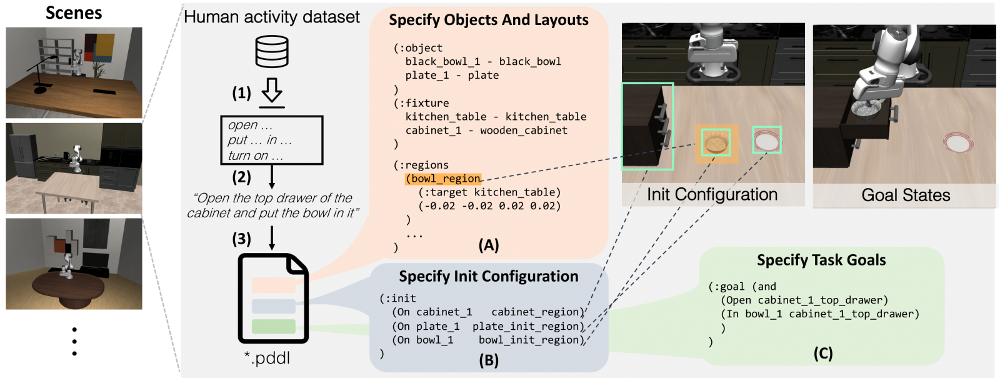
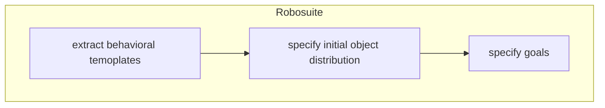
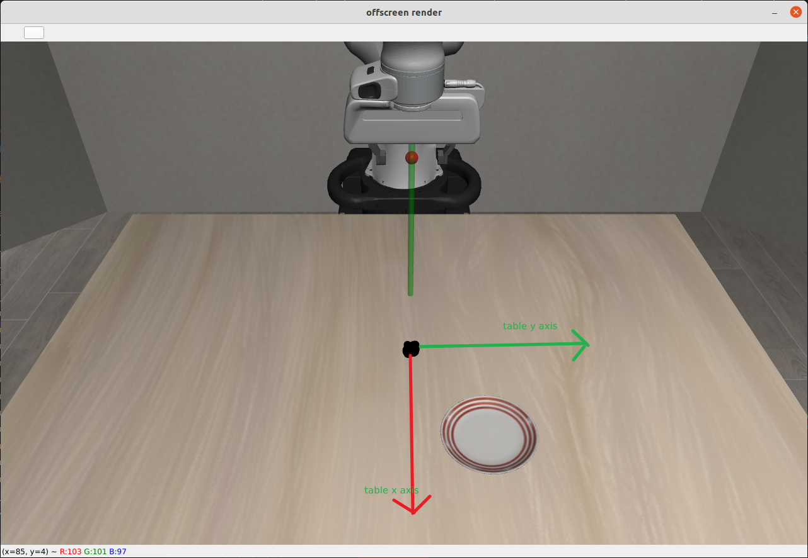
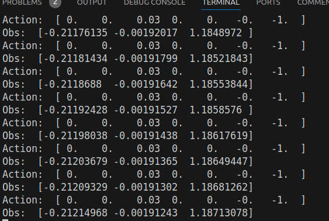
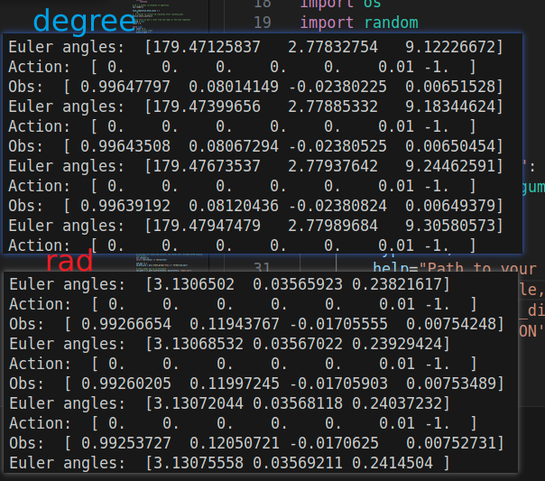
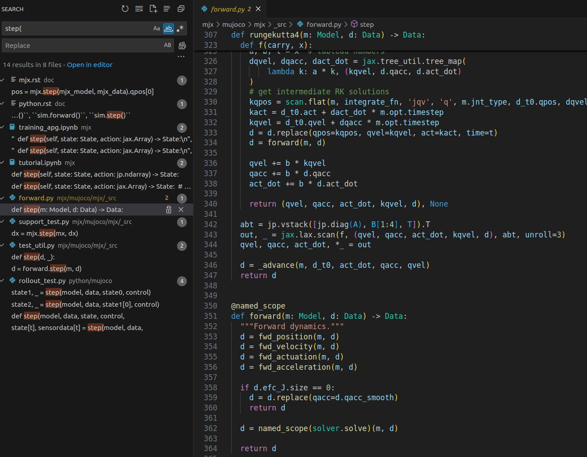

## 遥操作数据集收集指南
### 安装libero, docs:

https://lifelong-robot-learning.github.io/LIBERO/html/getting_started/overview.html

### 安装3D usb鼠标驱动：
不需要使用博客中最后的验证是否demo
https://blog.csdn.net/qq_40081208/article/details/137675822

### 修改```vendor_id```和```product_id```


把
```/home/${USER}/anaconda3/envs/libero/lib/python3.8/site-packages/robosuite/devices/spacemouse.py```
中的 vendor id 和 product id设置成上一个步骤设定的值。使用robosuite的代码，
```
 python3 demo_device_control.py --device=spacemouse
```

测试3D鼠标是否可以和robosuite环境正常交互


### 增大初始环境分布的variance
BDDLBaseDomain继承自robosuite的SingleArmEnv，然后可以一路继承到robot_env.py文件，可以看到这个参数的有关的描述
```
initialization_noise (dict or list of dict): Dict containing the initialization noise parameters ......
```


### bddl 描述性文件
BDDL 受 PDDL（Planning Domain Definition Language）的启发，但有所不同，它采用基于**谓词逻辑**的方式定义每个 BEHAVIOR 活动。

bddl定义了包括
- 初始化哪些物体
- 物体的位置的初始分布范围
- 定义 Task Goals（于Ego4D中的Template提取出来的 language instruction 是一致的）

<div style="text-align: center;">
	
</div>

### LIBERO 生成新的 Task 的working pipeline




在 ```(:init)```中，会初始化物体，就是决定环境中是否会有这个物体。
如果```(:init)```中没有物体其它地方代码块用到的话很可能会报下面的Warning，并且环境初始化的时候机械臂很卡，还可能自动重启环境。
```
WARNING: Nan, Inf or huge value in QACC at DOF 15. The simulation is unstable. Time = 49.6800.

```

- bddl 文件是 pddl 文件的变体，pddl(Planning Domain Definition Language)文件是，本项目中的```.bddl```文件大部分是 problem文件
- 范围  ```(x_min, y_min, x_max, y_max)```

### 坐标系

世界坐标系，可以根据桌子中心的位置去调整物体的相对初始位置
<div style="text-align: center;">
	
</div>


### 区域名称合成
貌似就这样子合成的，关于底层并不清楚
```
main_table_plate_region = (plate_region + (:target main_table)
```

panda机械臂 effector 坐标系

- rot-sensitivity 0.2：降低旋转灵敏度，方便控制机器人运动。

### 收集数据
生成一个完整的能用于训练的hdf5文件需要两个步骤

1. 收集人类示教控制轨迹，生成一个只含有```action```和```state```的 ```demo.hdf5```文件
```
python3 scripts/libero_100_collect_demonstrations.py --bddl-file /home/bwshen/LIBERO/libero/libero/bddl_files/libero_spatial/test.bddl --rot-sensitivity 0.5
```
2. 根据上一个步骤生成的```demo.hdf5```文件，生成含有图片数据的完整的```demo_full.hdf5```文件
```
python ./scripts/create_dataset.py --demo-file  /home/bwshen/LIBERO/demonstration_data/robosuite_ln_libero_tabletop_manipulation_1722083401_157395_pick_the_akita_black_bowl_between_the_plate_and_the_ramekin_and_place_it_on_the_plate/demo.hdf5 --use-actions --use-camera-obs
```
生成的文件目录结构
```
├──robosuite_ln_libero_tabletop_manipulation_1722083401_157395_pick_the_akita_black_bowl_between_the_plate_and_the_ramekin_and_place_it_on_the_plate
  ├── demo_full.hdf5
  └── demo.hdf5
```
可以使用这个网站可视化```hdf5```文件

https://myhdf5.hdfgroup.org/

如果想看人操控的playback,可以运行（这个运行参数并不会生成一个新的完整的```hdf5```文件）

```
python ./scripts/create_dataset.py --demo-file /home/bwshen/LIBERO/demonstration_data/robosuite_ln_libero_tabletop_manipulation_1722077082_394896_pick_the_akita_black_bowl_between_the_plate_and_the_ramekin_and_place_it_on_the_plate/demo.hdf5
```

### 单位
```Action```的posistion方面的单位是```cm```，```Obs```的单位是```m```
<div style="text-align: center;">
	
</div>

```Action```的rotation方面，分别从弧度和角度方面看似乎没有单位对应的关系

<div style="text-align: center;">
	
</div>


最终的step的最终的结算的源代码

<div style="text-align: center;">
	
</div>

### @TODO
- ~~明确```bddl```文件相关 param~~
    - ~~分布 var~~
    - ~~任务 def~~
- ~~修改 3D mouse 的控制模式直接控制 end effector 的位置和状态~~
- ~~数据收集,一个hdf5包括多个视角~~
- libero_100_collect_demonstrations.py和collect_demonstration.py是一样的
- #### action 和 endEffector 是不是同一个坐标系
  经过测试，action中的dpos和drotation都是始终在世界坐标系下的
- #### 查清楚存的是当前时刻的action还是下一个时刻的action
  
  应该是当前时刻的吧
  ```
  env.step(action)
  env.render()
  ```
- #### state 里面的 end effector pose 和 aciton 的区别是什么

  $$
  \text{end effector pose} = \int{\text{action}\cdot dt}+\text{initial end effector pose}
  $$

  对应代码
  ```
  action = np.concatenate([dpos, drotation, [grasp] * gripper_dof])
  ```
  然后，环境中运行仿真引擎进行运动学结算。
  ```
  env.step(action)
  ```
  关于```step()```函数的[定义](https://robosuite.ai/docs/source/robosuite.wrappers.html)

### Appendix
---

state 的 dictionary
```
Obs:  odict_keys(['robot0_joint_pos', 'robot0_joint_pos_cos', 'robot0_joint_pos_sin', 'robot0_joint_vel', 'robot0_eef_pos', 'robot0_eef_quat', 'robot0_gripper_qpos', 'robot0_gripper_qvel', 'akita_black_bowl_1_pos', 'akita_black_bowl_1_quat', 'akita_black_bowl_1_to_robot0_eef_pos', 'akita_black_bowl_1_to_robot0_eef_quat', 'cookies_1_pos', 'cookies_1_quat', 'cookies_1_to_robot0_eef_pos', 'cookies_1_to_robot0_eef_quat', 'glazed_rim_porcelain_ramekin_1_pos', 'glazed_rim_porcelain_ramekin_1_quat', 'glazed_rim_porcelain_ramekin_1_to_robot0_eef_pos', 'glazed_rim_porcelain_ramekin_1_to_robot0_eef_quat', 'plate_1_pos', 'plate_1_quat', 'plate_1_to_robot0_eef_pos', 'plate_1_to_robot0_eef_quat', 'robot0_proprio-state', 'object-state'])
```