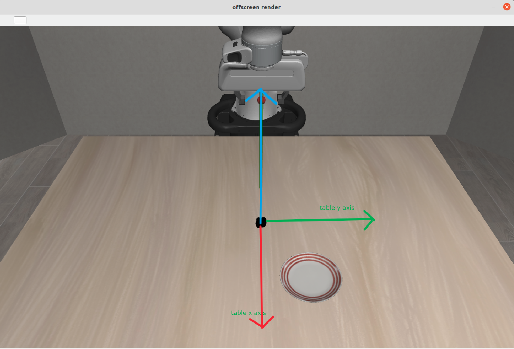

## 遥操作数据集收集指南
### 安装libero, docs:

https://lifelong-robot-learning.github.io/LIBERO/html/getting_started/overview.html

### 安装3D usb鼠标驱动：
不需要使用博客中最后的验证是否demo
https://blog.csdn.net/qq_40081208/article/details/137675822

### 修改```vendor_id```和```product_id```


把
```/home/${USER}/anaconda3/envs/libero/lib/python3.8/site-packages/robosuite/devices/spacemouse.py```
中的 vendor id 和 product id设置成上一个步骤设定的值。使用robosuite的代码，
```
 python3 demo_device_control.py --device=spacemouse
```

测试3D鼠标是否可以和robosuite环境正常交互


### 收集数据
到```scripts```目录下

```
python3 libero_100_collect_demonstrations.py --bddl-file /home/bwshen/LIBERO/libero/libero/bddl_files/libero_spatial/pick_up_the_black_bowl_between_the_plate_and_the_ramekin_and_place_it_on_the_plate.bddl
```


### 增大初始环境分布的variance
BDDLBaseDomain继承自robosuite的SingleArmEnv，然后可以一路继承到robot_env.py文件，可以看到这个参数的有关的描述
```
initialization_noise (dict or list of dict): Dict containing the initialization noise parameters.
The expected keys and corresponding value types are specified below:

:‘magnitude‘: The scale factor of uni-variate random noise applied to each of a robot's given initial
    joint positions. Setting this value to `None` or 0.0 results in no noise being applied.
    If "gaussian" type of noise is applied then this magnitude scales the standard deviation applied,
    If "uniform" type of noise is applied then this magnitude sets the bounds of the sampling range
:‘type‘: Type of noise to apply. Can either specify "gaussian" or "uniform"

Should either be single dict if same noise value is to be used for all robots or else it should be a
list of the same length as "robots" param

:Note: Specifying "default" will automatically use the default noise settings.
    Specifying None will automatically create the required dict with "magnitude" set to 0.0.
```


### bddl 文件相关
BDDL 受 PDDL（Planning Domain Definition Language）的启发，但有所不同，它采用基于谓词逻辑的方式定义每个 BEHAVIOR 活动。

在 ```(:init)```中，会初始化物体，就是决定环境中是否会有这个物体。
如果```(:init)```中没有物体其它地方代码块用到的话很可能会报下面的Warning，并且环境初始化的时候机械臂很卡，还可能自动重启环境。
```
WARNING: Nan, Inf or huge value in QACC at DOF 15. The simulation is unstable. Time = 49.6800.

```

- bddl 文件是 pddl 文件的变体，pddl(Planning Domain Definition Language)文件是，本项目中的```.bddl```文件大部分是 problem文件
- 范围  ```(x_min, y_min, x_max, y_max)```

### plain table 坐标系
可以根据桌子中心的位置去调整物体的相对初始位置
<div style="text-align: center;">
	
</div>

### 区域名称合成
貌似就这样子合成的，关于底层并不清楚
```
main_table_plate_region = (plate_region + (:target main_table)
```


- rot-sensitivity 0.2：降低旋转灵敏度，方便控制机器人运动。

### 收集数据
生成一个完整的能用于训练的hdf5文件需要两个步骤

1. 收集人类示教控制轨迹，生成一个只含有```action```和```state```的 ```demo.hdf5```文件
```
python3 scripts/libero_100_collect_demonstrations.py --bddl-file /home/bwshen/LIBERO/libero/libero/bddl_files/libero_spatial/pick_up_the_black_bowl_between_the_plate_and_the_ramekin_and_place_it_on_the_plate.bddl --rot-sensitivity 0.5
```
2. 根据上一个步骤生成的```hdf5```文件，生成含有图片数据的完整的```test.hdf5```文件
```
python ./scripts/create_dataset.py --demo-file  /home/bwshen/LIBERO/demonstration_data/robosuite_ln_libero_tabletop_manipulation_1722083401_157395_pick_the_akita_black_bowl_between_the_plate_and_the_ramekin_and_place_it_on_the_plate/demo.hdf5 --use-actions --use-camera-obs
```

如果想看人操控的playback,可以运行（这个运行参数并不会生成一个新的完整的```hdf5```文件）

```
python ./scripts/create_dataset.py --demo-file /home/bwshen/LIBERO/demonstration_data/robosuite_ln_libero_tabletop_manipulation_1722077082_394896_pick_the_akita_black_bowl_between_the_plate_and_the_ramekin_and_place_it_on_the_plate/demo.hdf5
```


### @TODO
- 明确```bddl```文件相关 param
    - 分布 var
    - 任务 def
- 修改 3D mouse 的控制模式直接控制 end effector 的位置和状态
- 数据收集,一个hdf5包括多个视角
- 查清楚存的是当前时刻的action还是下一个时刻的action
- action 和 endEffector 是不是同一个坐标系
